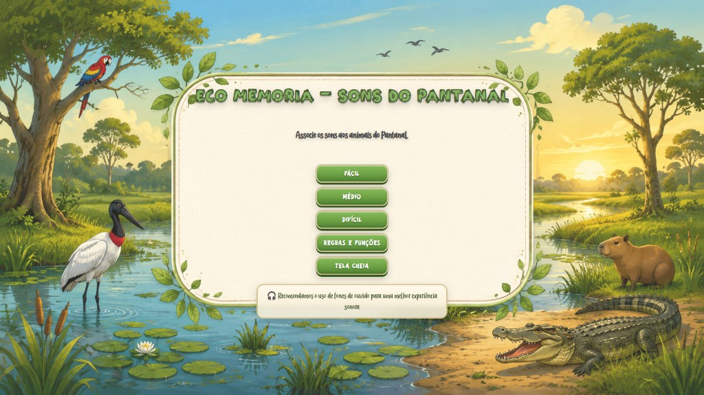
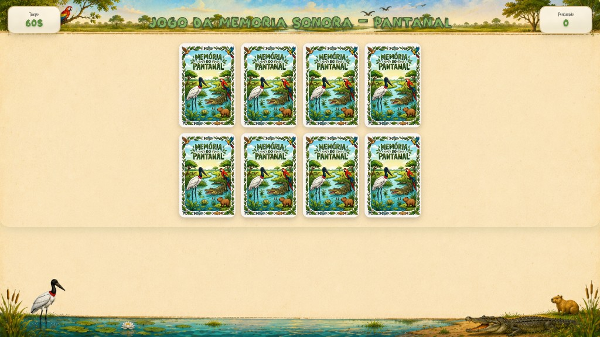
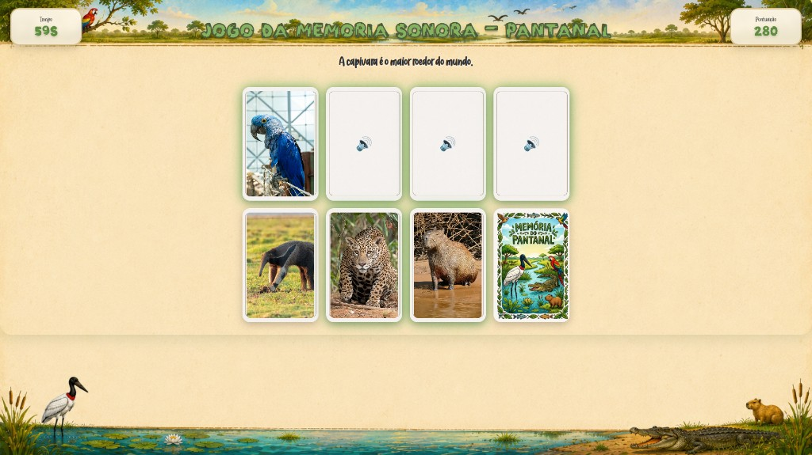
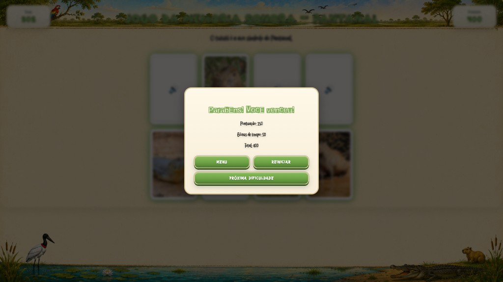

# Eco Memória — Sons do Pantanal 🌿🎮

<p align="center">
  
  
  
  
</p>

<p align="center">
  <strong>Jogo educativo digital sobre a fauna do Pantanal</strong><br>
  Teste prático para processo seletivo de bolsista - INPP/MCTI
</p>

<p align="center">
  <a href="https://lucas-c4rbone.github.io/Eco-Memoria/" target="_blank">
    
  </a>
</p>

---

## 📋 Sobre o Projeto

**Eco Memória — Sons do Pantanal** é um jogo da memória sonora desenvolvido como protótipo funcional para divulgação científica sobre a fauna do Pantanal. O jogador deve associar sons característicos de animais às suas respectivas imagens, promovendo o aprendizado de forma lúdica e interativa.

Este projeto foi desenvolvido como **teste prático** para o processo seletivo de bolsista no **Perfil 2 – Desenvolvimento de Aplicações Interativas/Jogos Educativos** do Instituto Nacional de Pesquisa do Pantanal (INPP), vinculado ao Ministério de Ciência, Tecnologia e Inovação (MCTI).

---

## 🎯 Funcionalidades Implementadas

### ✅ Funcionalidades Obrigatórias
- [x] **Cartas interativas**: Apresentação visual de animais do Pantanal
- [x] **Reprodução de sons**: Áudio característico ao interagir com elementos
- [x] **Associação correta**: Mecânica de matching entre som e imagem
- [x] **Sistema de pontuação**: Placar dinâmico com recompensas e penalidades

### ⭐ Funcionalidades Adicionais (Diferenciais)
- [x] **Feedback visual**: Animações de acerto (verde) e erro (vermelho)
- [x] **Feedback sonoro**: Efeitos sonoros para virar carta, acerto, erro e vitória
- [x] **Interface 100% responsiva**: Adaptada para desktop, tablets e mobile
- [x] **Três níveis de dificuldade**: 
  - 🟢 Fácil: 4 espécies (8 cartas)
  - 🟡 Médio: 6 espécies (12 cartas)
  - 🔴 Difícil: 8 espécies (16 cartas)
- [x] **Temporizador**: Contador regressivo com bônus de tempo por acerto
- [x] **Curiosidades**: Texto informativo sobre cada animal ao acertar
- [x] **Progressão automática**: Avanço entre níveis após conclusão
- [x] **Tela de carregamento**: Pré-carregamento de assets (imagens e áudios)
- [x] **Design temático**: Interface com identidade visual inspirada na natureza
- [x] **UX otimizada**: Animações 3D nas cartas, HUD flutuante, modais intuitivos

---

## 🛠️ Tecnologias Utilizadas

| Tecnologia | Uso |
|------------|-----|
| **HTML5** | Estrutura semântica, meta tags para mobile |
| **CSS3** | Layouts Grid e Flexbox, animações 3D (transform/perspective), responsividade |
| **JavaScript (Vanilla)** | Lógica do jogo, manipulação do DOM, controle de áudio |
| **Git/GitHub** | Versionamento e deploy (GitHub Pages) |

### Destaques Técnicos
- **CSS Grid**: Sistema de grids adaptáveis para diferentes quantidades de cartas
- **CSS 3D Transforms**: Efeito de flip realista nas cartas com `perspective` e `rotateY`
- **Audio API**: Controle preciso de sons com preloading
- **Viewport Units**: Layout proporcional (`vh`, `vw`, `clamp()`) para responsividade total
- **Mobile-First**: Design sem scroll vertical/horizontal em qualquer dispositivo

---

## 🚀 Como Executar

### Opção 1: Abrir Diretamente (Mais Simples)
1. Faça o download ou clone deste repositório
2. Navegue até a pasta do projeto
3. Clique duplo no arquivo **`index.html`**
4. O jogo abrirá no navegador padrão

### Opção 2: Servidor Local (Recomendado para Testes)
```bash
# Clone o repositório
git clone https://github.com/lucas-c4rbone/Eco-Memoria.git

# Acesse a pasta
cd Eco-Memoria

# Inicie um servidor local
python3 -m http.server 8000

# Abra no navegador
http://localhost:8000
```

> **Nota**: O uso de servidor local garante o correto carregamento de áudios em alguns navegadores.

---

## 📸 Screenshots

<p align="center">
  <strong>Tela Inicial - Menu Principal</strong><br>
  
</p>

<p align="center">
  <strong>Gameplay - Início</strong><br>
  
</p>

<p align="center">
  <strong>Gameplay - Finalizando</strong><br>
  
</p>

<p align="center">
  <strong>Tela de Vitória</strong><br>
  
</p>

---

## 🎮 Como Jogar

1. **Escolha a dificuldade** na tela inicial (Fácil, Médio ou Difícil)
2. **Memorize** as posições das cartas de som e imagem
3. **Toque em uma carta de som** 🔊 para ouvir o animal
4. **Toque na carta de imagem** 🖼️ correspondente
5. **Acerte** para ganhar pontos e tempo bônus (+5s)
6. **Complete todas** as combinações antes do tempo acabar!

### Regras de Pontuação
- ✅ **Acerto**: +100 pontos
- ⏱️ **Bônus de tempo**: +5 segundos por acerto
- ❌ **Erro**: -20 pontos + tempo de penalidade
- 🏆 **Vitória**: Bônus adicional baseado no tempo restante

---

## 🏗️ Estrutura do Projeto

```
Eco-Memoria/
├── 📄 index.html              # Estrutura HTML (telas, modais, tabuleiro)
├── 🎨 style.css              # Estilos (layout, animações 3D, responsividade)
├── ⚙️ script.js               # Lógica do jogo (timer, placar, sons, preload)
├── 📁 assets/
│   ├── 📁 images/            # Fotos dos animais, fundos, artes das cartas
│   │   ├── onca.jpg          # Onça-pintada
│   │   ├── arara.jpg         # Arara-azul
│   │   ├── jacare.jpg        # Jacaré-do-pantanal
│   │   ├── tuiuiu.jpg        # Tuiuiú
│   │   ├── capivara.jpg      # Capivara
│   │   ├── anta.jpg          # Anta
│   │   ├── ariranha.jpg      # Ariranha
│   │   ├── tamandua.jpg      # Tamanduá-bandeira
│   │   ├── background.png    # Fundo do menu
│   │   ├── backgroundCard.png # Fundo do jogo
│   │   ├── frenteCard.png    # Verso das cartas
│   │   └── costaCard.png     # Frente das cartas
│   ├── 📁 sounds/            # Sons dos animais
│   │   ├── onca.mp3
│   │   ├── arara.mp3
│   │   ├── jacare.mp3
│   │   ├── tuiuiu.mp3
│   │   ├── capivara.mp3
│   │   ├── anta.mp3
│   │   ├── ariranha.mp3
│   │   └── tamandua.mp3
│   ├── 📁 sfx/               # Efeitos sonoros
│   │   ├── flip.mp3          # Virar carta
│   │   ├── match.mp3         # Acerto
│   │   ├── wrong.mp3         # Erro
│   │   ├── win.mp3           # Vitória
│   │   └── click.mp3         # Clique em botão
│   └── 📁 fonts/             # Tipografias personalizadas
│       ├── Helvetica-Punk.ttf
│       ├── Lady-Nature.otf
│       ├── NATOOR.ttf
│       └── Nature-Breath.ttf
└── 📄 README.md              # Este arquivo
```

---

## 💡 Decisões de Design e Arquitetura

### UX/UI
- **Cores temáticas**: Paleta verde/natureza para transmitir a sensação do Pantanal
- **Tipografia customizada**: Fontes orgânicas e naturais para reforçar o tema
- **Animações suaves**: Transições de 0.7s com cubic-bezier para efeito natural
- **Feedback imediato**: Respostas visuais e sonoras em menos de 100ms

### Responsividade
- **Mobile-first**: Design baseado em viewport units (`vh`, `vw`)
- **Grids calculados**: Cada dificuldade tem grid específico (4x2, 4x3, 4x4)
- **Sem scroll**: 100% da interface visível sem rolagem vertical ou horizontal
- **Adaptação automática**: Cartas redimensionam proporcionalmente à tela

### Performance
- **Pré-carregamento**: Tela de loading garante experiência fluida
- **Áudio otimizado**: Volumes ajustados, evitando distorções
- **CSS puro**: Sem dependências externas, carregamento instantâneo

### Acessibilidade
- **Meta viewport**: Configurado para dispositivos móveis
- **Touch targets**: Áreas de toque mínimo de 48px
- **Contraste**: Cores com boa legibilidade em qualquer fundo

---

## 🎥 Demonstração em Vídeo

*[Adicione aqui um link para vídeo curto demonstrando o funcionamento]*

---

## 📝 Licença e Créditos

Este projeto foi desenvolvido **exclusivamente para fins educacionais** e avaliação do processo seletivo do INPP/MCTI.

### Conteúdo Utilizado
- **Imagens**: Fotografias de animais do Pantanal brasileiro
- **Sons**: Gravações de vocalizações dos animais
- **Fontes**: Tipografias com licença para uso pessoal/educacional

> ⚠️ **Atenção**: Verifique as licenças individuais dos assets antes de uso comercial.

---

## 👤 Autor

**Lucas Carbone Vieira**

<p align="left">
  <a href="https://github.com/lucas-c4rbone">
    
  </a>
</p>

---

<p align="center">
  <em>Projeto desenvolvido para o Instituto Nacional de Pesquisa do Pantanal (INPP)</em><br>
  <em>Ministério de Ciência, Tecnologia e Inovação (MCTI)</em>
</p>

<p align="center">
  🌿 <strong>Eco Memória — Sons do Pantanal</strong> 🌿
</p>
